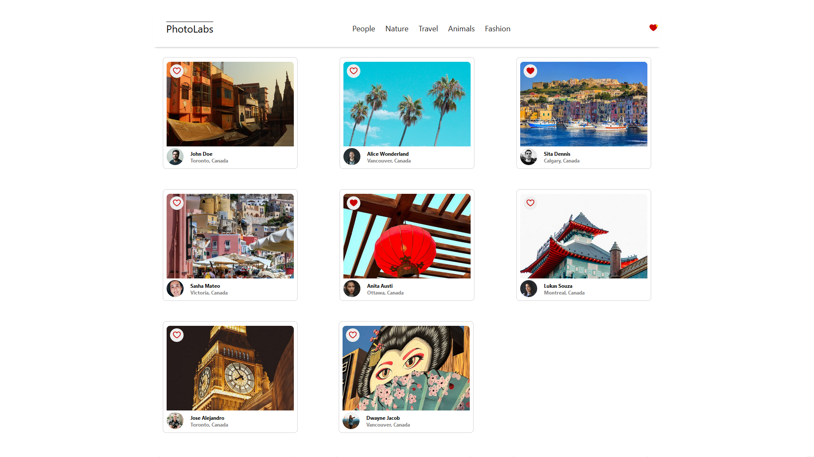

# react-photolabs
A basic image-viewing website created for the purpose of learning React which utilizes a psql database to retrieve all data. Images can be sorted by their topic, and favourited. Clicking on an item card will bring up a larger modal view of the selected image, as well as show related images below it.

# Photolabs



## Setup

Install dependencies with `npm install` in each respective `/frontend` and `/backend`.

## [Frontend] Running Webpack Development Server

```sh
cd frontend
npm start
```

## [Backend] Running Backend Servier

Read `backend/readme` for further setup details.

```sh
cd backend
npm start
```
